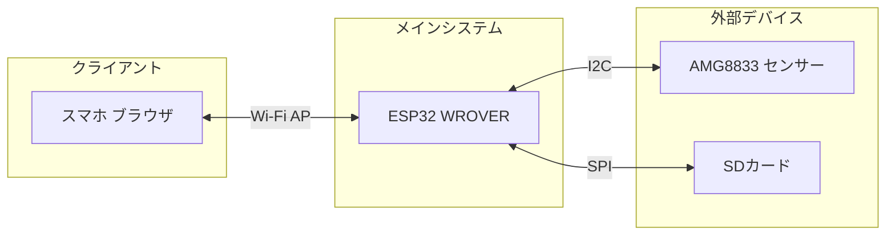
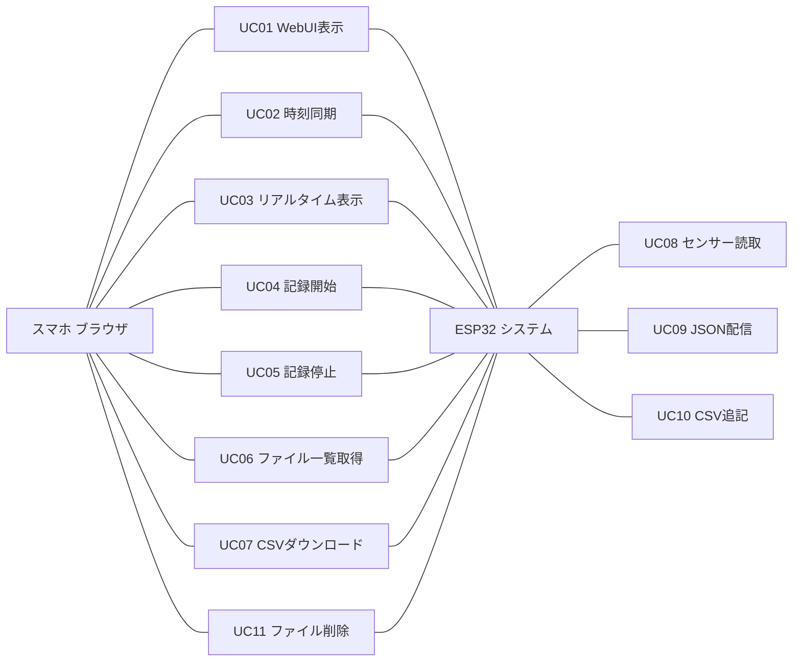
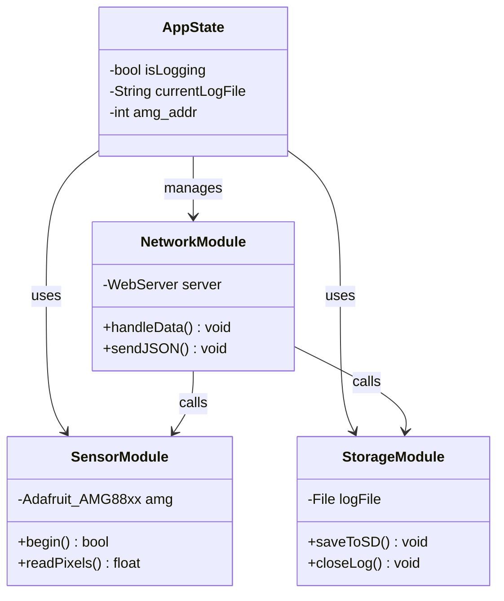
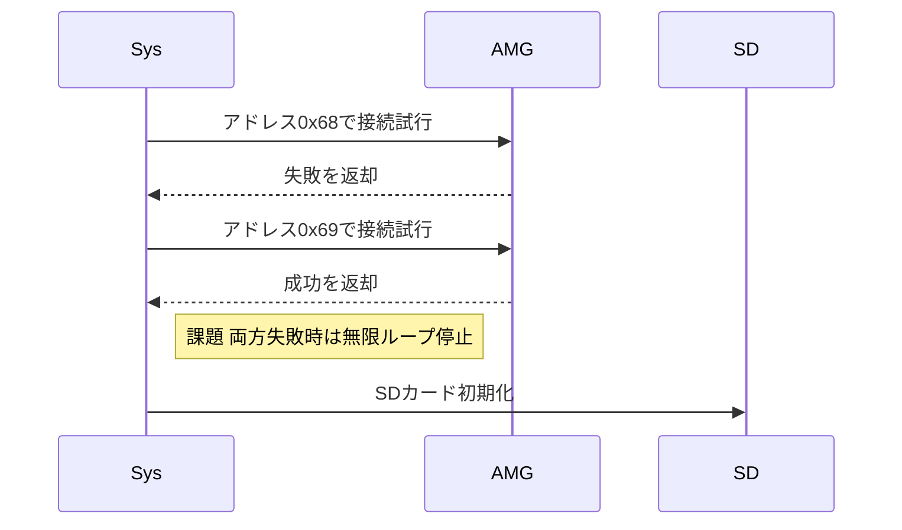
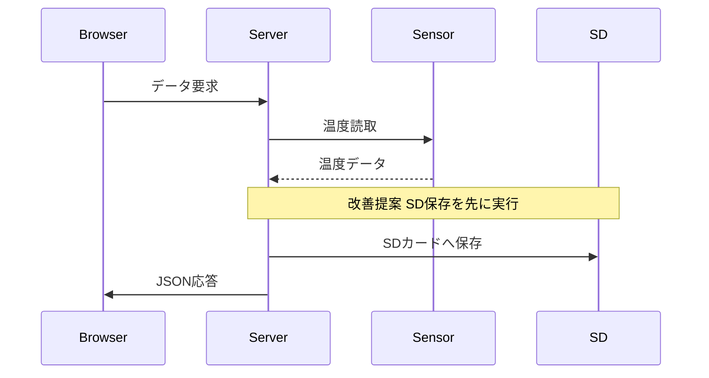
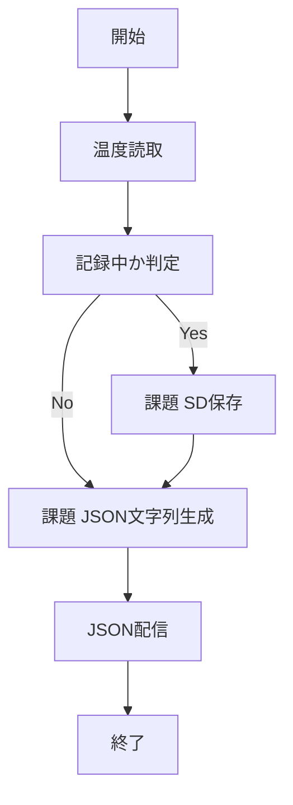
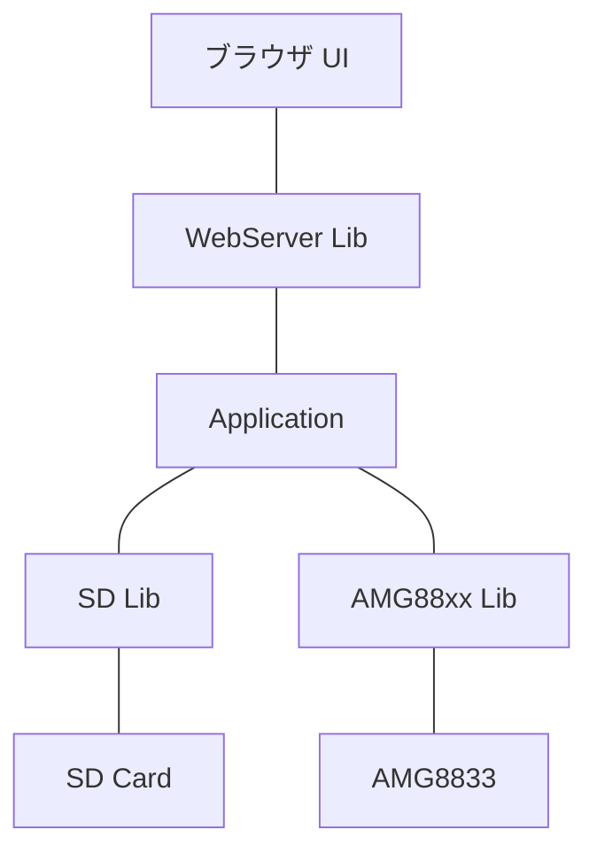

# UML仕様書 Thermal Mapper v13.1

**対象コード:** `06_ThermalMapLogger.ino`  
**作成者:** なかま合同会社 データロガー開発  
**作成日:** 2026年3月5日

---

## 第1章 システム概要・ハードウェア構成

本システムはESP32 WROVERをWi-Fiアクセスポイントとして動作させ、AMG8833から取得した温度データをスマホブラウザにリアルタイム配信しながら、SDカードにCSVとして記録するシステムです。外部ルーター不要でフォーミュラカーのコース・ピット上でも単独動作します。

---

## 第2章 ユースケース図

ユーザー（スマホブラウザ）とESP32（システム）の2アクターを定義し、システムが提供する機能とアクターの関係を示します。

---

## 第3章 クラス図

主要なコンポーネントと役割を定義します。

> **【クラス図における課題事項】**
> * **AppState:** toggle失敗時フラグ未処理
> * **SensorModule:** 初期化失敗時無限ループ停止の改善
> * **StorageModule:** SDカードのopenとcloseの毎回実行
> * **NetworkModule:** send前SD書込の順序問題

---

## 第4章 シーケンス図

### 4-A: 起動フェーズ

### 4-B: リアルタイム表示フェーズ

---

## 第5章 アクティビティ図 — handleData

---

## 第6章 コンポーネント図

---

## 第7章 HTTP APIエンドポイント仕様

> **【重要】** deleteのパス検証なし・toggleの失敗時未処理・syncのelseなし・listのroot_close漏れは今すぐ修正が必要です。

| エンドポイント | メソッド | 処理内容 |
| :--- | :--- | :--- |
| `/` | GET | WebUIを返す |
| `/data` | GET | 温度データをJSONで返す（SD記録も実行） |
| `/sync` | GET | ブラウザ時刻を受け取りシステム時刻を更新 |
| `/toggle` | GET | ロギングの開始や停止を切り替える |
| `/list` | GET | SD内のファイル一覧をJSONで返す |
| `/download` | GET | 指定されたCSVファイルをダウンロード |
| `/delete` | GET | 指定されたファイルを削除 |

---
